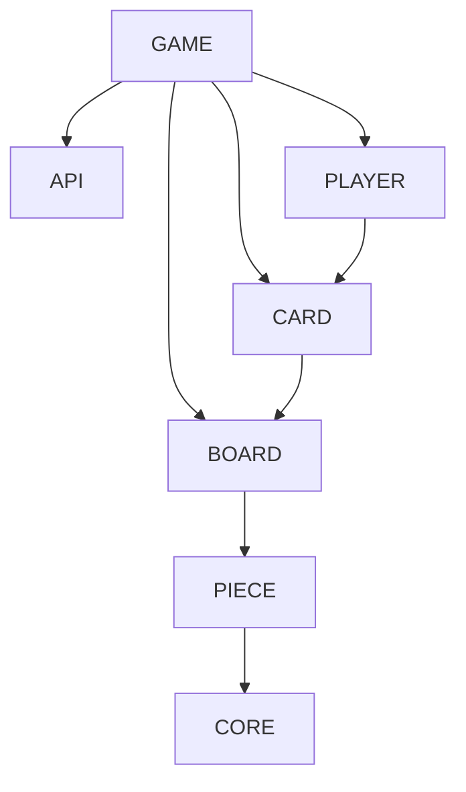

# StormOnTheChessBoard

## Controller
Nothing to report, simple SpringBoot REST controller.

## Repository
For now, it is a simple in memory fake database.  
It uses the Command Query Responsibility Segregation aka. CQRS principle.
It is deliberately over-engineering and not opportune, but it provides an easy way to undo moves.

## Model
Dependency graph of package
