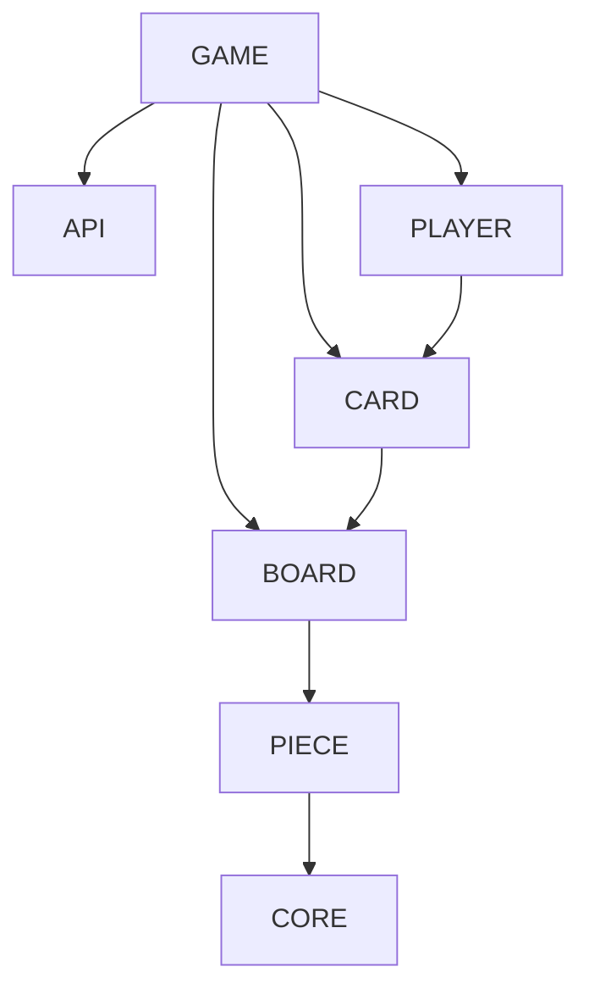
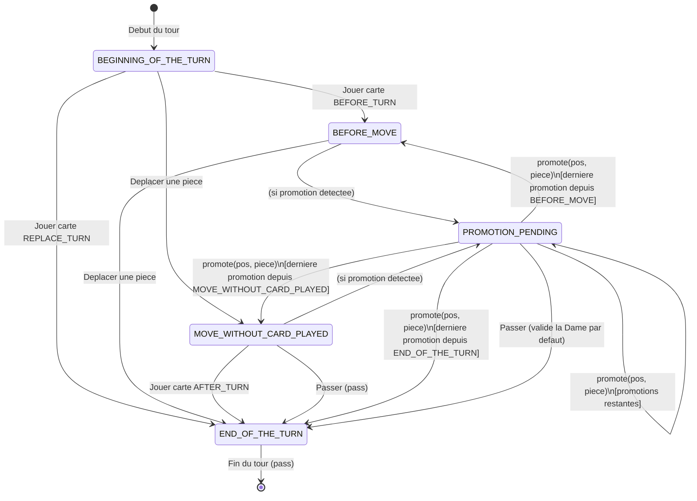

# Storm On The Chess Board

A chess variant where special cards modify the rules of the game.

Java 20 / Spring Boot backend, React / Expo frontend.

## Dev local

### Sans Docker

```bash
# Backend (port 9000)
mvn -pl controller spring-boot:run

# Frontend (port 8081)
cd front && npm install && npm run web
```

### Avec Docker

```bash
make up          # Lance backend + frontend
make down        # Arrete tout
```

### Avec Docker + mode 2 joueurs (nginx)

```bash
docker compose -f docker-compose-dev.yml up
```

Ouvrir `http://localhost` puis, une fois la partie creee :
- Onglet 1 : `http://localhost/<gameId>?color=white`
- Onglet 2 : `http://localhost/<gameId>?color=black`

Sans `?color`, le mode local (pass-the-device) est conserve.

## Deploiement production (kubys.fr)

Toutes les commandes se lancent depuis `deploy/` :

```bash
cd deploy
```

### Premier deploiement (Pi vierge)

```bash
make setup SETUP_USER=pi
```

Ce script idempotent se connecte au Pi en SSH et :
- Cree l'utilisateur `sotc`
- Copie les cles SSH
- Installe Docker
- Clone le repo dans `/home/sotc/app`

### Deployer

```bash
make deploy
```

Fait un `git fetch origin master && git reset --hard origin/master` sur le Pi puis `docker compose up --build -d`.
Idempotent : relancer ne casse rien, seul ce qui a change est reconstruit.

### Autres commandes

```bash
make status     # Etat des containers
make logs       # Logs en temps reel (Ctrl+C pour quitter)
make stop       # Arreter les containers
make restart    # Redemarrer sans rebuild
```

## Architecture

```
domain/       # Logique metier (pas de Spring)
repository/   # CQRS + stockage en memoire
controller/   # API REST + Spring Boot
front/        # React / Expo
deploy/       # Scripts et Makefile de deploiement
```

### Dependency graph


```mermaid
graph TD

GAME-->API
GAME-->PLAYER
GAME-->BOARD
GAME-->CARD
PLAYER-->CARD
CARD-->BOARD
BOARD-->PIECE
PIECE-->CORE 
```

### State Machine


```mermaid
stateDiagram-v2
    [*] --> BEGINNING_OF_THE_TURN: Debut du tour

    BEGINNING_OF_THE_TURN --> BEFORE_MOVE: Jouer carte BEFORE_TURN
    BEGINNING_OF_THE_TURN --> END_OF_THE_TURN: Jouer carte REPLACE_TURN
    BEGINNING_OF_THE_TURN --> MOVE_WITHOUT_CARD_PLAYED: Deplacer une piece

    BEFORE_MOVE --> END_OF_THE_TURN: Deplacer une piece
    BEFORE_MOVE --> PROMOTION_PENDING: (si promotion detectee)

    MOVE_WITHOUT_CARD_PLAYED --> END_OF_THE_TURN: Jouer carte AFTER_TURN
    MOVE_WITHOUT_CARD_PLAYED --> END_OF_THE_TURN: Passer (pass)
    MOVE_WITHOUT_CARD_PLAYED --> PROMOTION_PENDING: (si promotion detectee)

    END_OF_THE_TURN --> [*]: Fin du tour (pass)

    PROMOTION_PENDING --> PROMOTION_PENDING: promote(pos, piece)\n[promotions restantes]
    PROMOTION_PENDING --> BEFORE_MOVE: promote(pos, piece)\n[derniere promotion depuis BEFORE_MOVE]
    PROMOTION_PENDING --> END_OF_THE_TURN: promote(pos, piece)\n[derniere promotion depuis END_OF_THE_TURN]
    PROMOTION_PENDING --> MOVE_WITHOUT_CARD_PLAYED: promote(pos, piece)\n[derniere promotion depuis MOVE_WITHOUT_CARD_PLAYED]
    PROMOTION_PENDING --> END_OF_THE_TURN: Passer (valide la Dame par defaut)
```

Voir [TurnStateMachine.md](domain/src/main/java/fr/kubys/game/TurnStateMachine.md) pour la description detaillee des etats.

## API REST

Base : `http://localhost:9000/chessboard/` (dev) ou `http://kubys.fr/chessboard/` (prod)

| Methode | Endpoint | Description |
|---------|----------|-------------|
| POST | `/` | Nouvelle partie |
| GET | `/{gameId}` | Etat du plateau |
| POST | `/{gameId}/move/{from}/to/{to}` | Jouer un coup |
| POST | `/{gameId}/card/{cardName}` | Jouer une carte |
| POST | `/{gameId}/endTurn` | Fin de tour |
| POST | `/{gameId}/undo` | Annuler |