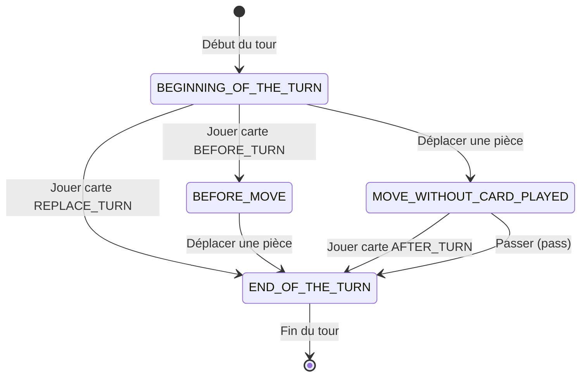

# Machine à États des Tours

Ce document décrit le fonctionnement de la machine à états qui gère le déroulement d'un tour de jeu dans Storm On The Chess Board.

## Diagramme des États

## Description des États

### 1. BEGINNING_OF_THE_TURN (Début de tour)
État initial de chaque tour. Le joueur a trois options :
- **Jouer une carte BEFORE_TURN** → Transition vers `BEFORE_MOVE`
- **Jouer une carte REPLACE_TURN** → Transition directe vers `END_OF_THE_TURN` (le tour se termine)
- **Déplacer une pièce** → Transition vers `MOVE_WITHOUT_CARD_PLAYED`

❌ Impossible de passer son tour dans cet état.

### 2. BEFORE_MOVE (Carte avant mouvement jouée)
Le joueur a déjà joué une carte BEFORE_TURN. Il doit maintenant :
- **Déplacer une pièce** → Transition vers `END_OF_THE_TURN`

❌ Impossible de jouer une autre carte (exception `CardAlreadyPlayedException`)
❌ Impossible de passer son tour

### 3. MOVE_WITHOUT_CARD_PLAYED (Mouvement sans carte)
Le joueur a déplacé une pièce sans avoir joué de carte avant. Il peut :
- **Jouer une carte AFTER_TURN** → Transition vers `END_OF_THE_TURN`
- **Passer** → Transition vers `END_OF_THE_TURN`

❌ Impossible de déplacer une autre pièce (exception `AlreadyMovedException`)
❌ Impossible de jouer une carte qui n'est pas AFTER_TURN

### 4. END_OF_THE_TURN (Fin de tour)
État terminal du tour. Toutes les actions sont verrouillées :

❌ Impossible de déplacer une pièce (exception `AlreadyMovedException`)
❌ Impossible de jouer une carte (exception `CardAlreadyPlayedException`)
✅ Passer est autorisé (mais n'a aucun effet)

Le tour se termine et un nouveau tour commence pour le joueur suivant.

## Types de Cartes

| Type | Description | Quand jouer |
|------|-------------|-------------|
| **BEFORE_TURN** | Carte jouée avant le déplacement | État `BEGINNING_OF_THE_TURN` |
| **REPLACE_TURN** | Remplace complètement le tour (pas de déplacement) | État `BEGINNING_OF_THE_TURN` |
| **AFTER_TURN** | Carte jouée après le déplacement | État `MOVE_WITHOUT_CARD_PLAYED` |
| **ENEMY_TURN** | *(à implémenter)* | ? |

## Implémentation

- **Interface** : `TurnState` (sealed interface)
- **Implémentations** :
  - `BeginningOfTheTurnState` (domain/src/main/java/fr/kubys/game/BeginningOfTheTurnState.java:7)
  - `BeforeMoveCardPlayedState` (domain/src/main/java/fr/kubys/game/BeforeMoveCardPlayedState.java:8)
  - `MoveWithoutCardPlayedState` (domain/src/main/java/fr/kubys/game/MoveWithoutCardPlayedState.java:9)
  - `EndOfTheTurnState` (domain/src/main/java/fr/kubys/game/EndOfTheTurnState.java:9)
- **Enum** : `StateEnum` (domain/src/main/java/fr/kubys/game/StateEnum.java:3)
- **Contrôleur** : `GameStateController` (gère les transitions)
